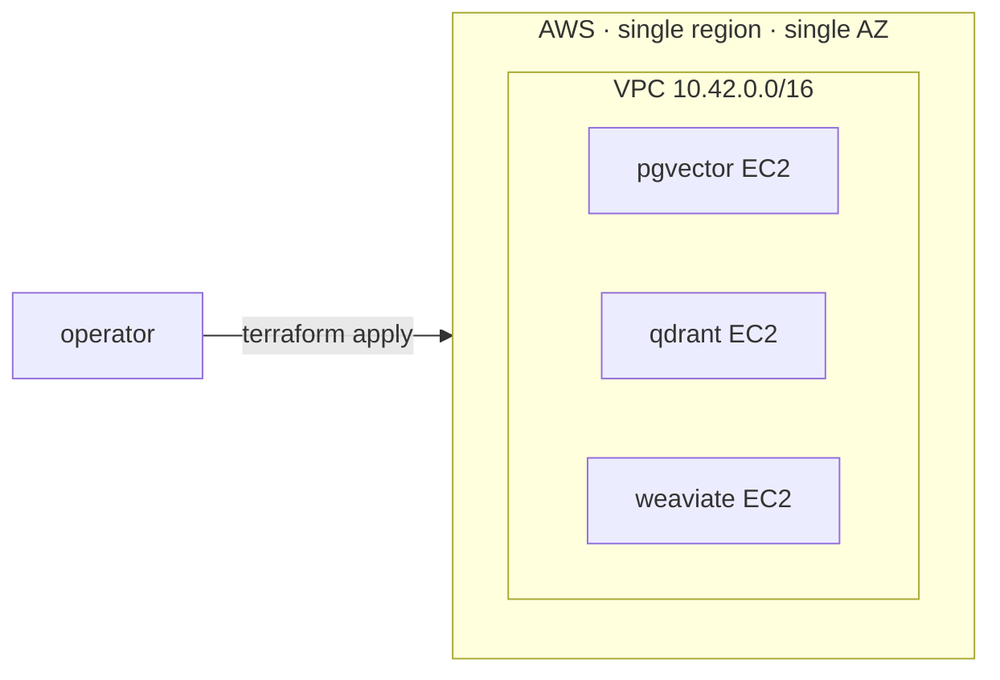

# vector-search-at-scale
> Empirical guide to vector search: pgvector vs. Qdrant vs. Weaviate at 1M / 10M / 100M vectors, HNSW tuning, latency under load, cost per query.


## What this is

The kind of doc you'd cite in an architecture review. This repo runs the
**same** benchmark — same corpus shape, same query workload, same EC2 instance
type, same EBS, same single-AZ — against three vector backends (pgvector,
Qdrant, Weaviate) at three corpus sizes (1M, 10M, 100M vectors). The output
is a Pareto frontier of recall / latency / cost across the matrix that's
reproducible by anyone who can run `make up` against an AWS account.

The interesting comparison isn't "engine X is fastest"; it's *what happens at
each scale*. At 1M everything fits in RAM and the engines look similar. At
10M the choice of HNSW parameters starts to dominate. At 100M the index
spills off-RAM and the engines diverge sharply on how gracefully they
degrade. This repo lets you see that divergence with your own eyes against
real EC2 instances, not vendor-published numbers.

The benchmark is built in three layers, each its own GitHub issue, each
reusing the layer below: **infra** (this PR, issue #1) → **harness** (#2) →
**per-axis studies** (#3 HNSW tuning, #4 latency under load, #5 cost per
query). The infra layer is the foundation; everything downstream re-uses
exactly the resources defined here so the numbers across studies are
apples-to-apples by construction.

## Architecture



Full diagram + per-layer breakdown in [`docs/architecture.md`](docs/architecture.md).
Per-tier instance sizing and on-demand cost table in [`docs/infra.md`](docs/infra.md).

## Quickstart

**Prereqs.** Terraform ≥ 1.6, an AWS account with EC2 / EBS / VPC permissions,
and credentials available to the AWS provider (`AWS_PROFILE`, env vars, or
SSO).

```bash
# 1. Validate every module without contacting AWS.
make validate

# 2. Format check (CI-equivalent).
make fmt-check

# 3. Plan a 1M-vector deployment in us-east-1a.
cd terraform/envs/benchmark
cp terraform.tfvars.example terraform.tfvars
# Edit terraform.tfvars to set scale_tier and (optionally) ssh_ingress_cidrs.
cd ../../..
make plan SCALE=1m

# 4. Apply — brings up VPC + 3 EC2 instances + 3 EBS data volumes.
make up SCALE=1m

# 5. Inspect the per-backend connection info.
make output

# 6. Tear it all back down. Always run this when the benchmark window closes —
#    the 100m tier costs ~$4.47/hr (see docs/infra.md).
make down SCALE=1m
```

The `Makefile` is the operator surface; the underlying Terraform lives in
`terraform/envs/benchmark/`.

## Benchmarks / Results

Pending. This PR ships the infra layer (issue #1). Real numbers come from
issues #2 (harness), #3 (HNSW tuning), #4 (latency under load), and #5 (cost
per query). When those land, this section gets a real Pareto frontier — not
before, per the project's no-fabricated-benchmarks rule.

## Demo

60-second demo pending until the harness (#2) ships.

## Why these decisions

See [MEMORY/core_decisions_human.md](MEMORY/core_decisions_human.md). Notable
decisions in this PR:

- **D-002.** AWS, single region, single AZ.
- **D-003.** Third backend = Weaviate (open-source, self-hostable). Pinecone
  rejected because it's SaaS-only and would compare cloud-vendor
  infrastructure rather than vector-DB engines.
- **D-004.** Single-node per backend, no replication, pinned-version Docker
  images.

## License

MIT
