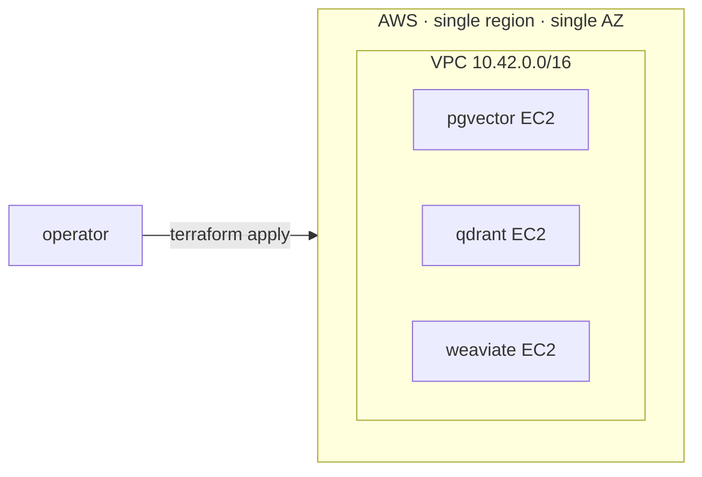
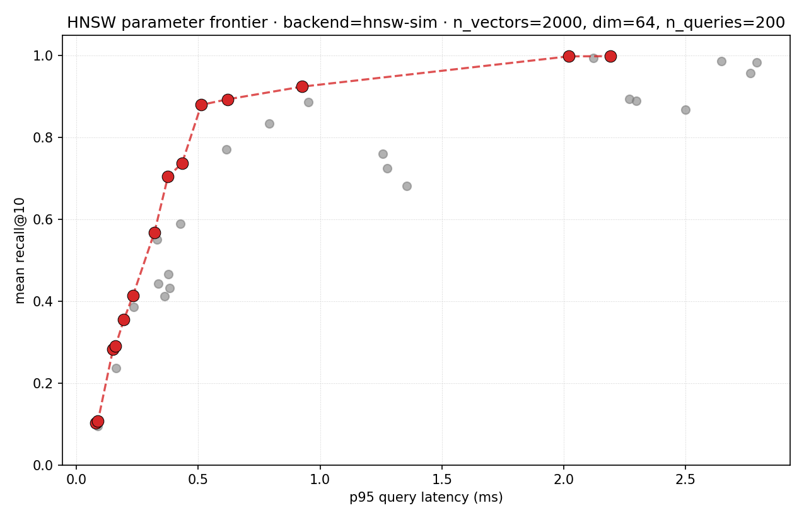

# vector-search-at-scale
> Empirical guide to vector search: pgvector vs. Qdrant vs. Weaviate at 1M / 10M / 100M vectors, HNSW tuning, latency under load, cost per query.


## What this is

The kind of doc you'd cite in an architecture review. This repo runs the
**same** benchmark — same corpus shape, same query workload, same EC2 instance
type, same EBS, same single-AZ — against three vector backends (pgvector,
Qdrant, Weaviate) at three corpus sizes (1M, 10M, 100M vectors). The output
is a Pareto frontier of recall / latency / cost across the matrix that's
reproducible by anyone who can run `make up` against an AWS account.

The interesting comparison isn't "engine X is fastest"; it's *what happens at
each scale*. At 1M everything fits in RAM and the engines look similar. At
10M the choice of HNSW parameters starts to dominate. At 100M the index
spills off-RAM and the engines diverge sharply on how gracefully they
degrade. This repo lets you see that divergence with your own eyes against
real EC2 instances, not vendor-published numbers.

The benchmark is built in three layers, each its own GitHub issue, each
reusing the layer below: **infra** (this PR, issue #1) → **harness** (#2) →
**per-axis studies** (#3 HNSW tuning, #4 latency under load, #5 cost per
query). The infra layer is the foundation; everything downstream re-uses
exactly the resources defined here so the numbers across studies are
apples-to-apples by construction.

## Architecture



Full diagram + per-layer breakdown in [`docs/architecture.md`](docs/architecture.md).
Per-tier instance sizing and on-demand cost table in [`docs/infra.md`](docs/infra.md).

## Quickstart

**Prereqs.** Terraform ≥ 1.6, an AWS account with EC2 / EBS / VPC permissions,
and credentials available to the AWS provider (`AWS_PROFILE`, env vars, or
SSO).

```bash
# 1. Validate every module without contacting AWS.
make validate

# 2. Format check (CI-equivalent).
make fmt-check

# 3. Plan a 1M-vector deployment in us-east-1a.
cd terraform/envs/benchmark
cp terraform.tfvars.example terraform.tfvars
# Edit terraform.tfvars to set scale_tier and (optionally) ssh_ingress_cidrs.
cd ../../..
make plan SCALE=1m

# 4. Apply — brings up VPC + 3 EC2 instances + 3 EBS data volumes.
make up SCALE=1m

# 5. Inspect the per-backend connection info.
make output

# 6. Tear it all back down. Always run this when the benchmark window closes —
#    the 100m tier costs ~$4.47/hr (see docs/infra.md).
make down SCALE=1m
```

The `Makefile` is the operator surface; the underlying Terraform lives in
`terraform/envs/benchmark/`.

### Benchmark harness (`vector-bench run`)

The Python package layered on top of the infra runs the same workload
against any of the three backends and writes structured JSON per run.
Hermetic flow (no AWS, no SDKs, runs in a couple seconds):

```bash
python3 -m venv .venv && source .venv/bin/activate
pip install -e '.[dev]'
pytest                                    # 23 hermetic tests pass
vector-bench run --backend stub \
  --n 1000 --dim 64 --queries 50 --top-k 10 \
  --run-id smoke-001
# → writes results/smoke-001.json (deterministic; mean_recall_at_k = 1.0)
```

Real-backend flow (assumes `make up SCALE=1m` is up and the operator has
set the per-engine env vars):

```bash
pip install -e '.[pgvector,qdrant,weaviate]'

PGVECTOR_DSN=postgresql://... \
  vector-bench run --backend pgvector --n 1000000 --dim 768 \
                   --queries 200 --top-k 10 --run-id pgvector-1m-001

QDRANT_URL=http://... \
  vector-bench run --backend qdrant   --n 1000000 --dim 768 \
                   --queries 200 --top-k 10 --run-id qdrant-1m-001

WEAVIATE_HOST=... \
  vector-bench run --backend weaviate --n 1000000 --dim 768 \
                   --queries 200 --top-k 10 --run-id weaviate-1m-001
```

The harness records every workload field on the result, so apples-to-apples
comparison between backends is just diffing the JSON.

## Benchmarks / Results

The harness (issue #2) is shipped and exercised hermetically in CI. **Real
numbers from the three live backends are pending the operator running
`make up SCALE=1m` followed by the per-engine `vector-bench run` commands
above** — per the project's no-fabricated-benchmarks rule, this section
stays empty until those JSONs exist. Once they do, issue #3 (HNSW tuning)
and #5 (cost per query) compose the harness to produce the Pareto frontier.

### Latency under load (#4)

`vector-bench load --backend <b> --n <N> --concurrency 1,10,100 --run-id <id>`
ingests once and queries at each concurrency level using `ThreadPoolExecutor`,
writing one JSON per cell + a `matrix.json` summary under
`results/load/<id>/`. `scripts/plot_latency.py` reads one or more
`matrix.json` files and emits a markdown table plus optional PNG charts
(matplotlib is lazy-imported; degrades to "chart skipped" if absent).

The committed `results/load/stub-10k/matrix.json` is a real
in-process numpy run (10 000 corpus vectors × 64 dims × 500 queries, M-series
Mac, Python 3.11, recall@10 = 1.0 by construction):

| concurrency | stub p50 ms | stub p95 ms | stub p99 ms |
| --- | --- | --- | --- |
| 1   | 0.612 | 0.675 | 0.730 |
| 10  | 0.844 | 1.320 | 2.143 |
| 100 | 1.740 | 4.297 | 5.472 |

The shape ("p99 walks up faster than p50 as concurrency grows") is the
GIL-bound stub showing thread contention on a numpy matmul; live engines
will follow a different curve dominated by the network and the engine's
internal HNSW search work — that's the comparison the per-backend
`docs/latency-under-load/` PNGs will surface once the operator runs the
real engines. The k6/locust formulation in the original issue body was
re-scoped to ThreadPoolExecutor-over-`Backend`-Protocol (D-008) so the
same load script works against all three backends; see decision for the
deliberation.

### HNSW parameter tuning (#3)



`scripts/hnsw_grid.py` grids over the three canonical HNSW knobs (`M`,
`ef_construction`, `ef_search`) and writes one `BenchmarkResult` JSON
per cell plus an aggregated `grid.json`. `scripts/plot_hnsw_frontier.py`
loads the grid, picks the non-dominated cells on
(p95 latency, recall@10), and renders PNG + SVG with the frontier in red.

The committed plot is **real** on the `hnsw-sim` simulation backend
(2 000 unit-Gaussian vectors × 64 dims × 200 queries, 36 grid cells).
`HnswSimBackend` is a pure-numpy *simulation* of HNSW's recall/latency
tradeoff — not a real HNSW implementation; see
[`src/vector_bench/backends/hnsw_sim.py`](src/vector_bench/backends/hnsw_sim.py)
for the model. The same scripts work against the real engines when
their bring-up lands — pass `--backend qdrant` (or `pgvector` /
`weaviate`) and the grid + plot regenerate against measured numbers.

**Recommended defaults** (knee at recall ≥ 0.95, picked from the
committed simulation grid):

| M | ef_construction | ef_search | recall@10 | p95 (ms) |
|--:|---:|---:|---:|---:|
| 32 | 100 | 128 | 0.998 | 2.02 |

Reproduce:

```bash
python scripts/hnsw_grid.py \
    --M 8,16,32 --ef-construction 50,100,200 --ef-search 16,32,64,128 \
    --out-dir results/hnsw-grid
python scripts/plot_hnsw_frontier.py results/hnsw-grid/grid.json \
    --out-png docs/hnsw/frontier.png --out-svg docs/hnsw/frontier.svg \
    --recall-floor 0.95
```

D-009 records the simulation-not-real-implementation framing.

### Cost per query (#5)

`scripts/cost_table.py` combines the per-tier infra sizing from
[`terraform/envs/benchmark/main.tf`](terraform/envs/benchmark/main.tf)
with the documented AWS us-east-1 list-price snapshot in
[`src/vector_bench/prices.py`](src/vector_bench/prices.py) and the
measured `throughput_qps` from
`results/load/<run_id>/c001.json` to write
[`docs/cost_per_query.md`](docs/cost_per_query.md) with the per-tier
table. The cost model itself lives in
[`src/vector_bench/cost.py`](src/vector_bench/cost.py) and accepts a
caller-supplied `PriceTable` so operators with contracted rates
(Reserved, Spot, EDP) compute the same table against their own
numbers without editing repo state.

Headline figure from the committed snapshot (`stub-10k` throughput
≈ 1623 qps used as a simulated stand-in for real-engine numbers at
10M / 100M scale — the `(simulated)` annotation in the table makes
this explicit):

| Scale | Instance | Monthly $ | $/M queries |
|---|---|---:|---:|
| 1m | `m6i.large`  | $74.08 | $0.02 |
| 10m | `r6i.xlarge`  | $219.96 | $0.05 |
| 100m | `r6i.4xlarge` | $915.84 | $0.21 |

The monthly cost is identical across the three engines because they
share the same instance + EBS sizing per tier (D-010); the
cost-per-query differences between engines therefore come from
*throughput* differences, not hardware differences. The amortization
assumes a 24/7 sustained workload; bursty production workloads
multiply the per-query number by `24 / avg_active_hours_per_day`.

```bash
# Refresh after editing Terraform sizing or the price snapshot.
python scripts/cost_table.py --dry --out docs/cost_per_query.md
```

D-010 records the snapshot-prices-with-override posture.

## Demo

60-second demo pending until the harness (#2) ships.

## Why these decisions

See [MEMORY/core_decisions_human.md](MEMORY/core_decisions_human.md). Notable
decisions in this PR:

- **D-002.** AWS, single region, single AZ.
- **D-003.** Third backend = Weaviate (open-source, self-hostable). Pinecone
  rejected because it's SaaS-only and would compare cloud-vendor
  infrastructure rather than vector-DB engines.
- **D-004.** Single-node per backend, no replication, pinned-version Docker
  images.

## License

MIT
