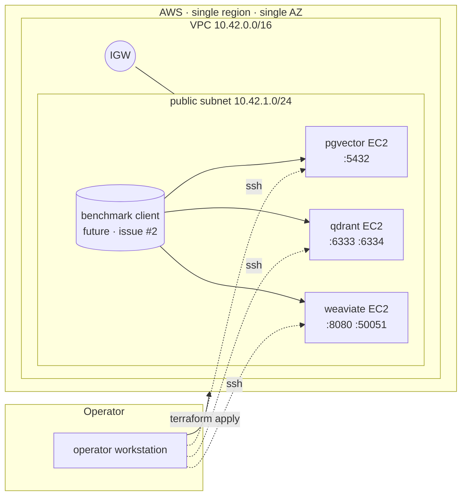

# Architecture

The benchmark substrate has three layers. This PR (issue #1) ships the bottom
one. The harness (issue #2) and the per-axis studies (issues #3, #4, #5) plug
into the same VPC and the same set of three backends.

## Layer 1 — Infra (this PR · issue #1)

- One VPC, one public subnet, one IGW. Single AZ on purpose: any cross-AZ
  millisecond would muddy the latency comparison between engines.
- Three backend modules. Each module is *self-contained*: EC2 + EBS data
  volume + service-specific security group + `user_data.sh` that brings the
  service up via Docker on first boot.
- The benchmark `env` composes the modules at one of three scale tiers (`1m`,
  `10m`, `100m`); the tier drives instance type and EBS sizing per
  [`docs/infra.md`](./infra.md).
- Service ports are restricted to the VPC CIDR. Optional SSH ingress is
  default-empty.
- Operator workflow lives in the `Makefile`: `make up SCALE=1m` /
  `make down SCALE=1m`.

## Layer 2 — Benchmark harness (issue #2 · pending)

A single-script harness ingests N vectors at a configured `dim`, runs queries
with a configured concurrency, and emits structured JSON per run. Same
workload runs against all three backends so the only thing differing between
runs is the engine.

## Layer 3 — Per-axis studies (issues #3, #4, #5 · pending)

- HNSW parameter tuning (`#3`): grid over `M`, `ef_construction`, `ef_search`
  and plot the recall/latency frontier per backend.
- Latency under load (`#4`): k6 / locust drivers at 1, 10, 100 concurrent
  clients per backend × scale.
- Cost per query (`#5`): combine layer 1 cost + layer 3 query telemetry to
  amortize $/query at each scale.

Each study reuses layers 1 and 2 unmodified. The deliberate output is one
benchmark.md table per study with reproducible numbers.
